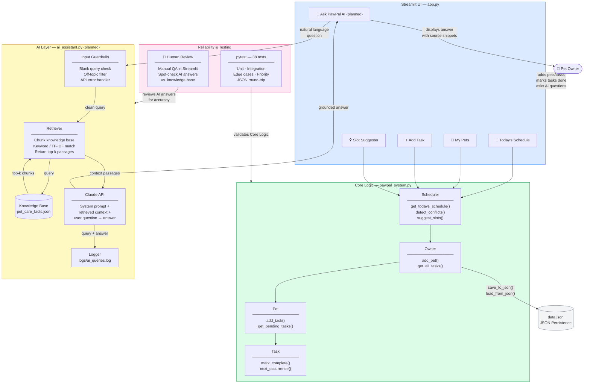

```mermaid
flowchart TD
    User([👤 Pet Owner])

    subgraph UI ["Streamlit UI — app.py"]
        T1["📅 Today's Schedule"]
        T2["🐶 My Pets"]
        T3["➕ Add Task"]
        T4["💡 Slot Suggester"]
        T5["🤖 Ask PawPal AI ‹planned›"]
    end

    subgraph Core ["Core Logic — pawpal_system.py"]
        Scheduler["Scheduler\n─────────────────\nget_todays_schedule()\ndetect_conflicts()\nsuggest_slots()"]
        Owner["Owner\n─────────────────\nadd_pet()\nget_all_tasks()"]
        Pet["Pet\n─────────────────\nadd_task()\nget_pending_tasks()"]
        Task["Task\n─────────────────\nmark_complete()\nnext_occurrence()"]
    end

    subgraph AI ["AI Layer — ai_assistant.py ‹planned›"]
        Retriever["Retriever\n─────────────────\nChunk knowledge base\nKeyword / TF-IDF match\nReturn top-k passages"]
        KB[("Knowledge Base\npet_care_facts.json")]
        Claude["Claude API\n─────────────────\nSystem prompt +\nretrieved context +\nuser question → answer"]
        Logger["Logger\nlogs/ai_queries.log"]
        Guard["Input Guardrails\n─────────────────\nBlank query check\nOff-topic filter\nAPI error handler"]
    end

    subgraph Testing ["Reliability & Testing"]
        PyTest["pytest — 38 tests\n─────────────────\nUnit · Integration\nEdge cases · Priority\nJSON round-trip"]
        Human["👥 Human Review\n─────────────────\nManual QA in Streamlit\nSpot-check AI answers\nvs. knowledge base"]
    end

    Persist[("data.json\nJSON Persistence")]

    %% User → UI
    User -- "adds pets/tasks\nmarks tasks done\nasks AI questions" --> UI

    %% UI → Core
    T1 & T2 & T3 & T4 --> Scheduler
    Scheduler --> Owner --> Pet --> Task

    %% Core → Persist
    Owner -- "save_to_json()\nload_from_json()" --> Persist

    %% UI → AI
    T5 -- "natural language\nquestion" --> Guard

    %% AI pipeline
    Guard -- "clean query" --> Retriever
    Retriever -- "query" --> KB
    KB -- "top-k chunks" --> Retriever
    Retriever -- "context passages" --> Claude
    Claude -- "grounded answer" --> T5
    Claude -- "query + answer" --> Logger

    %% AI → User
    T5 -- "displays answer\nwith source snippets" --> User

    %% Testing
    PyTest -- "validates Core Logic" --> Core
    Human -- "reviews AI answers\nfor accuracy" --> AI

    %% Styles
    style UI fill:#dbeafe,stroke:#3b82f6
    style Core fill:#dcfce7,stroke:#16a34a
    style AI fill:#fef9c3,stroke:#ca8a04
    style Testing fill:#fce7f3,stroke:#db2777
    style Persist fill:#f3f4f6,stroke:#6b7280
```
