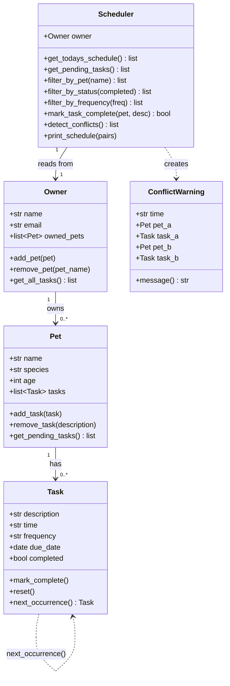

# PawPal+ Design Reflection

## Phase 1: System Design with UML + AI Support

### Step 1: Understanding the Problem

#### Scenario Analysis

**Three Core Actions a User Should Perform:**
1. **Register pets** — Add each pet with their name, species, and age so the system knows who to schedule care for.
2. **Schedule tasks** — Assign recurring or one-time care activities (walks, feedings, medications) to specific pets at specific times.
3. **Track and complete tasks** — Mark tasks done each day and let the system automatically schedule the next occurrence for recurring activities.

---

### 1a. Initial Design

**Classes Designed:**

```
Task
- Responsibility: Represent a single care activity
- Attributes: description, time, frequency, due_date, completed
- Methods: mark_complete(), reset(), next_occurrence()

Pet
- Responsibility: Store pet profile and own a list of tasks
- Attributes: name, species, age, tasks
- Methods: add_task(), remove_task(), get_pending_tasks()

Owner
- Responsibility: Manage multiple pets; provide unified task access
- Attributes: name, email, owned_pets
- Methods: add_pet(), remove_pet(), get_all_tasks()

Scheduler
- Responsibility: The algorithmic brain — sort, filter, detect conflicts, automate recurrence
- Attributes: owner
- Methods: get_todays_schedule(), get_pending_tasks(), filter_by_pet(),
           filter_by_status(), filter_by_frequency(), mark_task_complete(),
           detect_conflicts(), print_schedule()

ConflictWarning
- Responsibility: Represent a detected conflict as a typed object with a readable message
- Attributes: time, pet_a, task_a, pet_b, task_b
- Methods: message()
```

---

### 1b. Design Changes

**Refinements made during implementation:**

1. **Added `ConflictWarning` class** — The initial design returned raw tuples from `detect_conflicts()`. A dedicated class was introduced so that: (a) the UI and CLI can both call `.message()` without reformatting, (b) the conflict carries typed references to both pets and tasks, and (c) detection logic is separated from display logic.

2. **Added `due_date` to `Task`** — Not in the original skeleton. Required to implement `next_occurrence()` using `timedelta`. Without a due date, recurring scheduling would have no anchor point.

3. **`next_occurrence()` lives on `Task`, not `Scheduler`** — An earlier approach put recurrence logic in the `Scheduler`. Moving it to `Task` keeps the class self-contained: a Task knows how to produce its successor. The Scheduler only decides *when* to call it (after marking complete).

4. **`detect_conflicts()` uses `defaultdict` grouping, not nested loops** — The naive O(n²) approach (compare every pair) was replaced with O(n) grouping by time slot. The nested loop is still present within each slot, but for real-world schedules the slot size is tiny.

---

### 1c. UML Diagram

See [uml_final.md](uml_final.md) for the rendered Mermaid.js diagram.



---

## Phase 2: Core Logic Implementation

### 2a. Scheduling Algorithm

The Scheduler uses Python's `sorted()` with a `lambda` key on the task's `time` string:

```python
sorted(all_tasks, key=lambda pair: pair[1].time)
```

Because times are stored in `"HH:MM"` 24-hour format, lexicographic string sorting produces correct chronological order without needing to parse them into `datetime` objects. This keeps the code simple and fast (O(n log n)).

### 2b. Conflict Detection — Tradeoffs

**Strategy chosen:** Group tasks by their exact `HH:MM` time slot using a `defaultdict`, then flag any slot containing more than one task.

**Tradeoff:** The system only detects *exact time matches* — it does not model task durations or overlapping windows. For example, a 30-minute walk starting at `08:00` and a feeding at `08:15` would not be flagged as a conflict, even though they overlap in real life.

**Why this tradeoff was made:**
- Task durations are not stored in the data model (adding them would require a `duration` field and more complex interval-overlap logic).
- For a basic scheduling assistant, exact-time conflict warnings are the most common and useful signal.
- The implementation returns `ConflictWarning` objects with readable `.message()` strings rather than raising exceptions — it warns without crashing, which is the right behavior for a scheduling tool.

**What would be needed to improve this:**
- Add a `duration_minutes: int` field to `Task`.
- Use an interval-overlap algorithm: check if `[start_a, start_a + dur_a]` overlaps `[start_b, start_b + dur_b]` instead of exact equality.

### 2c. Recurring Tasks

When `mark_task_complete()` is called via the Scheduler, it checks the task's `frequency`. For `"daily"`, `"weekly"`, and `"monthly"` tasks, it calls `task.next_occurrence()` which uses Python's `timedelta` to compute the next due date and returns a fresh, uncompleted `Task` object. That task is appended to the pet's task list. `"once"` tasks return `None` from `next_occurrence()` and no new task is created.

---

## Phase 3: CLI & Testing

### 3a. Demo Script Results

`main.py` demonstrates all algorithmic features in the terminal:
- Tasks are added intentionally **out of chronological order**, then the sorted schedule proves the algorithm works
- Filters (`filter_by_pet`, `filter_by_status`, `filter_by_frequency`) each print a filtered view
- Completing a `daily` task shows the task count increase as the next occurrence is appended
- Completing a `weekly` task shows the new due date is exactly 7 days later
- Completing a `once` task shows the count stays the same (no recurrence)
- Conflict detection prints `ConflictWarning.message()` strings for every clash

### 3b. Test Coverage

**25 automated tests across 8 categories — all passing.**

Tests cover happy paths (normal operation) and edge cases:
- Pet with no tasks → empty schedule, no crash
- Owner with no pets → all scheduler methods return empty lists
- Unknown pet/task name → `mark_task_complete()` returns `False` gracefully
- Case-insensitive pet name filtering (`"luna"` matches `"Luna"`)
- `ConflictWarning.message()` contains the time, both task names — verified by string assertion
- `next_occurrence()` preserves description, time, and frequency exactly

---

## Phase 4: Streamlit UI

### 4a. UI Design

The Streamlit app has three tabs and a sidebar:

- **Sidebar** — Live metrics (pets, total tasks, pending count) and a green/red conflict indicator
- **Today's Schedule tab** — Three composable filter controls (pet, status, frequency) wired to Scheduler methods; conflicting rows highlighted in orange; checkbox completion triggers `mark_task_complete()` and auto-recurrence
- **My Pets tab** — Pet cards with `st.metric()` counts (total/pending/done); per-pet task list sorted by time
- **Add Task tab** — Pre-flight conflict check warns before the user submits if the chosen time already has a task

### 4b. Key UI Decision: Conflict Presentation

A conflict warning is most helpful when it:
1. **Does not block the user** — shown as `st.warning()`, not `st.error()` or a modal
2. **Is specific** — each `ConflictWarning.message()` names both tasks and the shared time slot
3. **Is surfaced at the right moment** — the conflict expander opens automatically; the add-task form warns immediately on time selection

---

## Final Reflection: AI-Human Collaboration

### Which AI features were most effective?

The most effective technique across all phases was using **context-grounded prompts** — providing the actual code file alongside the question. Asking "based on `pawpal_system.py`, how should the Scheduler retrieve tasks?" produced precise, implementation-specific answers rather than generic patterns.

For algorithmic design, asking AI to **compare two approaches** ("nested loop vs. defaultdict grouping for conflict detection") was more valuable than asking it to generate one solution, because it forced an explicit tradeoff discussion that shaped the final design choice.

### One AI suggestion rejected to keep the design clean

During conflict detection, AI suggested raising a `SchedulingConflictError` exception when conflicts were detected. This was rejected because a scheduling assistant should **inform, not interrupt** — a pet owner clicking "complete" on a task should never see an uncaught exception. The alternative (`ConflictWarning` as a return value with `.message()`) keeps the Scheduler's contract clean: it always returns a list, and the caller decides how to present it.

### How separate chat sessions helped

Each phase had a distinct cognitive goal — design, algorithms, testing, UI — and mixing them in one session caused earlier answers to pollute later context. Starting fresh for testing, for example, allowed the AI to reason about the *final* API surface rather than intermediate sketches. It also forced a cleaner hand-off: what the implementation actually was (the code) rather than what it was supposed to be (earlier prompts).

### Lead architect role

The most important lesson: **AI accelerates generation, but the human controls acceptance.** Every method signature, every tradeoff, every class boundary required a deliberate decision about whether the AI's suggestion fit the design. The `ConflictWarning` class, the `next_occurrence()` placement on `Task`, the `defaultdict` grouping strategy — these were all cases where AI offered an option and the human evaluated it against the whole system.

Being the lead architect means staying one step ahead of the generated code: knowing what question to ask next, knowing when an AI suggestion solves the wrong problem, and knowing when "good enough" is actually good enough for the current phase.

---

## Extension Challenges Reflection

### Challenge 1 — Next Available Slot

The key design question was: generate slots lazily (stop at the first free one) vs. eagerly (collect all free slots, then slice). Lazy generation via a `for` loop with an early return is simpler and uses O(1) memory — the `suggest_slots` variant builds a list but stops at `count`. The 24-hour boundary wraps using `% (24*60)` so the algorithm handles "after 23:00" correctly without special-casing midnight.

### Challenge 2 — JSON Persistence

The main serialization decision was: use a third-party library (e.g., `marshmallow`) vs. hand-roll `to_dict` / `from_dict`. The hand-rolled approach was chosen because: (a) the object graph is shallow and predictable, (b) it adds zero dependencies, and (c) it's easier to read during a code review. The atomic write pattern (`write to .tmp → rename`) was added after considering what happens if the process is interrupted mid-write — `rename` is atomic on POSIX systems.

### Challenge 3 — Priority Scheduling

Sorting by `(priority_rank, time)` tuple was more Pythonic than adding an `if priority == "high"` branch inside the sort comparator. Python's tuple comparison is element-by-element, so the compound key handles all cases without explicit conditionals.

### Prompt Comparison (Challenge 5)

**Task tested:** "Implement a method that finds the next free time slot in a 24-hour schedule given a set of occupied HH:MM slots."

**Approach A (iterative, naive):**
```python
# Generate every minute, check membership
for minute in range(24 * 60):
    h, m = divmod(minute, 60)
    if f"{h:02d}:{m:02d}" not in occupied:
        return f"{h:02d}:{m:02d}"
```
Simple but iterates up to 1440 times and returns minute-granularity results, which isn't useful for scheduling.

**Approach B (step-based, chosen):**
```python
for i in range(steps):
    candidate_total = (start_total + i * step_minutes) % total_minutes_in_day
    h, m = divmod(candidate_total, 60)
    candidate = f"{h:02d}:{m:02d}"
    if candidate not in occupied:
        return candidate
```
More Pythonic: parameterized granularity, modular arithmetic for midnight wrap, early return. The `step_minutes` parameter makes it reusable for both 15-min and 30-min slot systems. **Approach B was chosen** because it maps to how pet care is actually scheduled (30-minute blocks, not minute-by-minute).

**Key learning:** The "more modular" solution was also the more readable one here. The parameters (`after`, `step_minutes`) serve as documentation — they name the assumptions that would otherwise be buried in magic numbers.

---

**What went well:** Iterative, phase-by-phase building meant each layer was verified before the next was added. The CLI demo in Phase 2 caught issues before the UI existed, which saved significant debugging time.

**Challenges encountered:** Streamlit's stateless re-run model required careful session_state design. Early versions lost all pet data on every button click until the `if "owner" not in st.session_state` pattern was established.

**Key tradeoffs discovered:**
- Exact-time vs. duration-based conflict detection (simplicity vs. accuracy)
- Storing `time` as a string vs. a `datetime` object (simplicity vs. type safety)
- Appending recurring tasks to the same list vs. generating them fresh each day (simplicity vs. memory growth over time)
