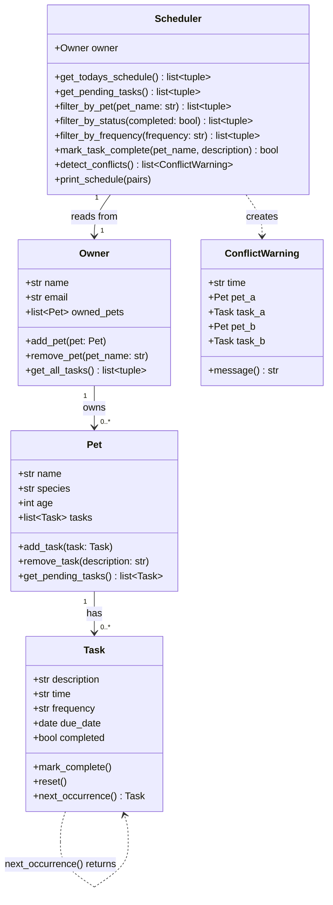

# PawPal+ — Final System Architecture (UML)

This diagram reflects the **final implementation** in `pawpal_system.py`.

## Key Design Decisions

| Decision | Rationale |
|---|---|
| `Scheduler` reads from `Owner`, not `Pet` directly | Single entry point; Owner acts as the data boundary |
| `ConflictWarning` is a separate class | Decouples detection logic from display; `.message()` can be used by CLI or UI |
| `Task.next_occurrence()` on the Task itself | Keeps recurrence logic encapsulated in the data class, not the Scheduler |
| `time` stored as `"HH:MM"` string | Lexicographic order = chronological order for 24h format; no parsing needed |
| `due_date` stored as `date` object | Enables `timedelta` arithmetic for recurring task scheduling |
